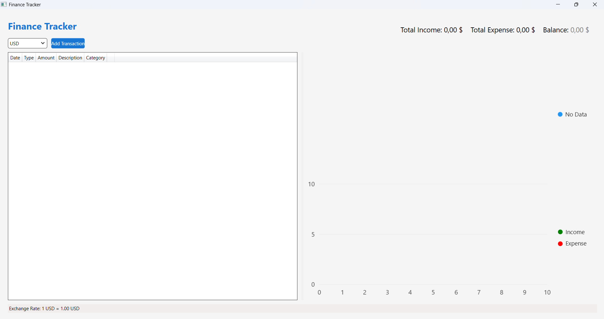
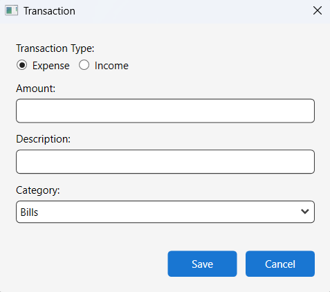
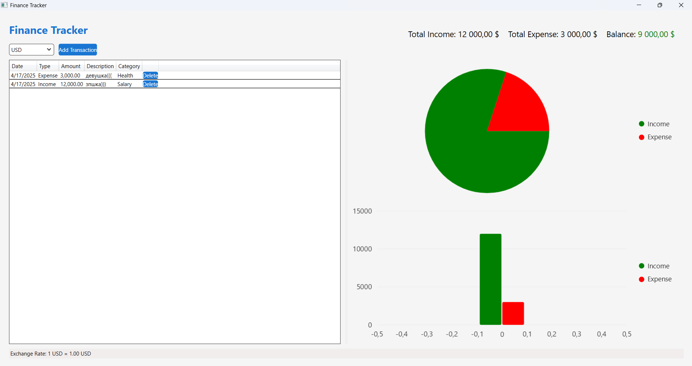
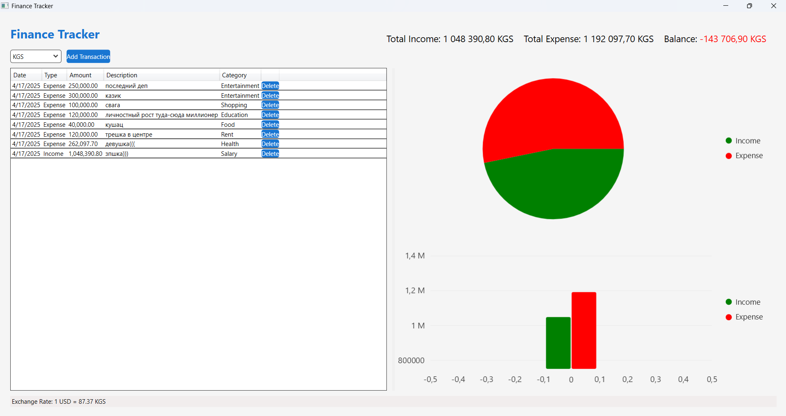

# Finance Tracker

An application for personal finance accounting with charts and integration with the exchange rate API.

## Functionality

- Accounting of income and expenses
- Categorization of transactions
- Data visualization using LiveCharts
- Tracking currency exchange rates
- Export data to CSV/Excel
- Setting up spending limits

## Technology

- C# (.NET 8)
- WPF (Windows Presentation Foundation)
- LiveCharts for visualization
- Entity Framework Core with SQLite
- Exchange Rate API for currency exchange rates

## Installation

1. Clone the repository
2. Open the solution in Visual Studio 2022/JetBrains Rider
3. Restore NuGet packages
4. Add your API key to `Core/App Config.cs`
5. Launch the app

## Usage

1. Select the desired currency from the dropdown (USD is selected by default).
   
2. Click **Add Transaction** to open the transaction dialog.
   
3. Choose **Expense** or **Income** using the radio buttons.
4. Enter the amount, description, and select a category.
   
5. Click **Save** to add the transaction.
6. View your transactions in the table and see summary statistics:
   - **Total Income**
   - **Total Expense**
   - **Balance**
   - Visual charts (pie and bar)
   
7. Change the currency at any time to view all amounts in another currency.